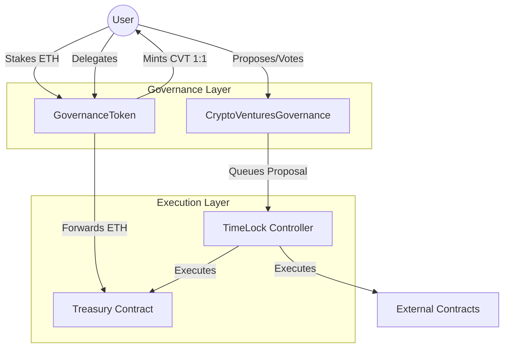

# System Architecture

## High-Level Overview

The CryptoVentures DAO Governance System is designed as a modular, secure, and tiered governance framework. It decouples token economics (voting power) from execution (timelock) and logic (governor), ensuring upgradability and security.

## Component Breakdown

### 1. Governance Token (`GovernanceToken.sol`)
*   **Role**: Staking derivative and voting instrument.
*   **Mechanism**:
    *   `deposit()`: Accepts ETH, mints CVT 1:1. ETH is sent to Treasury.
    *   `withdraw()`: Burns CVT, pulls ETH from Treasury.
    *   `getVotes()`: Returns `Math.sqrt(balance)` (Quadratic Voting).
    *   **Clock**: Uses `block.timestamp` for precise time-based governance.

### 2. CryptoVentures Governance (`CryptoVenturesGovernance.sol`)
*   **Role**: Decision engine.
*   **Extensions**: `Governor`, `GovernorSettings`, `GovernorCountingSimple` (modified), `GovernorVotes`, `GovernorVotesQuorumFraction` (modified).
*   **Key Logic**:
    *   **Multi-Tier**: Maps `ProposalType` to strict configs.
    *   **Tiered Quorum**: Overrides `_quorumReached` to calculate thresholds based on voting *power*, not just supply.
    *   **Tiered Delay**: Manually orchestrates `TimelockController` interactions to enforce variable delays (6h, 1d, 2d).

### 3. Treasury (`Treasury.sol`)
*   **Role**: Asset Vault.
*   **Security**:
    *   `AccessControl`: Only `WITHDRAWER_ROLE` (Token) and `EXECUTOR_ROLE` (Timelock) can move funds.
    *   **Fund Categories**: Logical separation of funds (e.g., Operational vs. Experimental) for accounting (future scope).

### 4. TimeLock (`TimeLock.sol`)
*   **Role**: Enforcer.
*   **Configuration**:
    *   **Proposers**: Only the Governance contract.
    *   **Executors**: Public (anyone can execute after delay).
    *   **MinDelay**: Base safety buffer.

## Design Decisions

*   **Quadratic Voting**: Chosen to mitigate "Whale" influence. A user with 100x more capital has only 10x more votes.
*   **Manual Timelock Integration**: Standard `GovernorTimelockControl` was bypassed to allow per-proposal flexible delays, which is not natively supported by the standard extension without global resets.
*   **ETH-Backing**: Ensures the token has intrinsic value (1 CVT = 1 ETH), aligning incentives (rage-quit capability).
